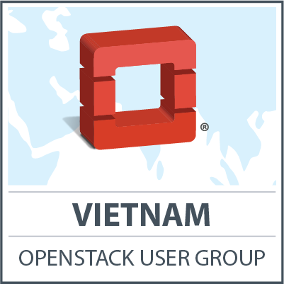

# VietOpenStack
# Official User Group

contact@vietopenstack.org

<http://www.vietopenstack.org/>

---

# /me

- Name: [Hieu LE][1]
- [Vietnam][1] OpenStack Community Organizer
- OpenStack [ATC][1]
- OpenStack Project Leader @ Fujitsu
- Executive member @ VFOSSA

[1]: http://

---

# Outline

- VietOpenStack Overview
- Group statistics (05/2016)
  - Members
  - Meet-up
  - Topic
- GOALS - Activities
  - Goals
  - Activities
- VietStack ⇋ Triple-[C][1]
- Q&A

[1]: http://

---

# Overview

- Launched: [Feb][1] 13, [2014][1]
- [Official][1] OpenStack User Group
- Approved by [OpenStack][] Foundation (top 12)

[1]: http://
[OpenStack]: http://www.openstack.org

Note:
VS khoi diem tu ngay 13/2/2014, ban dau duoi mong muon tao mot kenh trao doi giua cac anh em ky thuat.

## Connect
- FB: http://facebook.com/groups/vietstack
- TW: http://twitter.com/VietStack
- Blog: http://www.vietstack.com
- Git: http://github.com/vietstacker
- Meetup: http://www.meetup.com/VietStack/
- Email: [contact@vietopenstack.org][]

[contact@vietopenstack.org]: mailto:contact@vietopenstack.org

---

# Group Statistics

- Members
- Meet-ups
- Topics

## ~ [1900][] Member (05/2016)
- [07][1] organizers:
  - Hieu LE: Fujitsu
  - Tuan Luong: Erricson Hungary
  - Cong To: VNPT-DATA
  - Hoang Cao: Fujitsu
  - Giang Duong: DTT
  - Son Tran: DTT
  - Kien Nguyen: VNU
- ~[20][1] active member
  - From Hanoi to HCM city.

[1]: http://
[1900]: http://

Note:
Thang 4 va 5, VS tien hanh viet mot so blog chia se ve cach tim hieu OpenStack

## Meet-ups
- Organize [09][1] meet-ups from 2013 up to now.
  - [01][1] Common meetup with ~[120][1] attendances
  - [01][1] Upstream training with ~[80][1] attendances
  - [01][1] Technical meet-up in [Saigon][1] with ~[30][1] attendances

[1]: http://

## Topics
- Focusing topic:
 - Multi-hypervisor
 - Storage
 - Networking
 - Monitor
 - Anything related to OpenStack.

Note:
Nhom duy tri 1 tuan 1 topic chinh de update va trao doi, su dung lam can cu cho public meetup sau nay
Cac thanh vien tham gia chia se gom tu chinh trong nhom: CongTT, TuanLH, HieuLQ, QuanHD, ThangMV.. cho toi cac member trong cong dong

---

# GOALS - Activities
Up to 2017

## Goals
- [Cloud Computing][1] & [OpenStack][1] knowledge sharing
- Building an OpenStack-geek Team
- Co-op with [Vietnamese][1] Community for solving OPS problems
- Connect with other communitycommunity members inside and outside [Vietnam][1]
- Contribute to [OpenStack Foundation][1]

[1]: http://

Note:
- Muc tieu

## Activities

- Public Meetup <!-- .element: class="fragment" data-fragment-index="1" -->
- Connecting Technical-Cloud-DevOp guys <!-- .element: class="fragment" data-fragment-index="2" -->
- Communication Channel <!-- .element: class="fragment" data-fragment-index="3" -->
- Publish technical post (via FB, Blog..) <!-- .element: class="fragment" data-fragment-index="4" -->

---

# Communication
# Channel

- Skype Group
- Slack channel: http://vietstack.slack.com
- Facebook Group
- *Mailing list*
- *IRC*

---

## Technical Knowledge

- All about OpenStack
- Coding
- In the future: BigData, SDN..

Note:

---

# VietStack ⇋ Triple-[C][1]

Triple[C][1]: [C][1]ommunity - [C][1]ollege - [C][1]orporation

[1]: http://

# ⇨

- [C][1]ommunity: news, updates, information, bug fix
- [C][1]ollege: tailoring, support for [R][1]&[D][1]
  - OSS Olympic IT contest
  - *Vietnam Summer of Codes*
- [C][1]orporation: problem solving, consultant

[1]: http://

# ⇦

- [C][1]ommunity: open & sharing
- [C][1]ollege: [R][1]&[D][1] ideas
  - Recruiments
- [C][1]orporation: [Sponsor][1] (meetup location, marketing, LAB..)

[1]: http://

---

# VietOpenStack 
# Thank You All !

