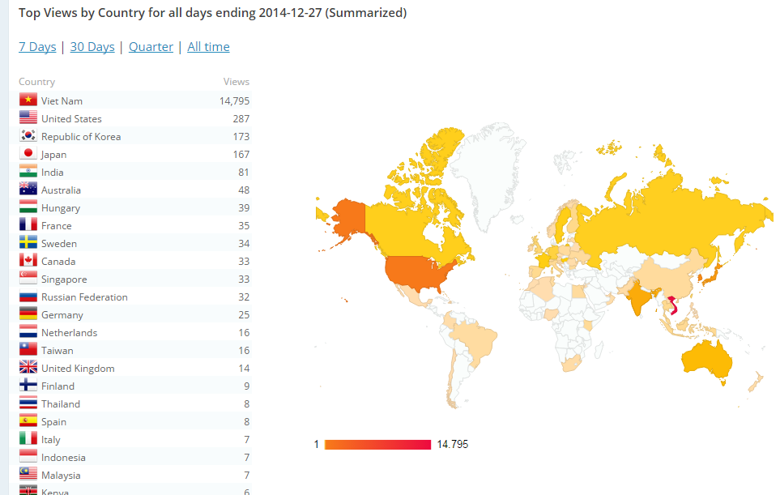

# Hello World
# VietStack !

Hanoi

vietstack@gmail.com  

<http://vietstack.com/>

---

# Outline

- VietStack Overview
- Group statistics (12/2014)
  - Members
  - Blog Views
  - Topic
- GOALS - Activities
  - Goals
  - Activities
- VietStack ⇋ Triple-[C][1] 
- Q&A

[1]: http://

---

# VietStack Overview

- Launched: [Feb][1] 13, [2014][1]
- Vietnamese Technical Channel about [Cloud Computing][1]
- Rapidly update with [OpenStack][] Community

[1]: http://
[OpenStack]: http://www.openstack.org

Note:
VS khoi diem tu ngay 13/2/2014, ban dau duoi mong muon tao mot kenh trao doi giua cac anh em ky thuat.

## Connect
- FB: http://facebook.com/groups/vietstack
- TW: http://twitter.com/VietStack
- Blog: http://www.vietstack.com	
- Git: http://github.com/vietstacker	
- Meetup: http://www.meetup.com/VietStack/	
- Email: [vietstack@gmail.com][]

[vietstack@gmail.com]: mailto:vietstack@gmail.com

---

# Group Statistics

- Members
- Blog Views
- Topics

## ~ [800][] Member (12/2014)

[800]: http://

Note:
Thang 4 va 5, VS tien hanh viet mot so blog chia se ve cach tim hieu OpenStack

## Blog Views
- Blog View: ~[1500][] monthly

[1500]: http://

## Top Views by Country
- Top view: [VN][1] & [US][1]

[1]: http://

Note: Blog da duoc mirantis crawl

## Topics
- Weekly topic by VietStack group:
 - Multi-hypervisor
 - Storage
 - Networking
 - Monitor
 
Note: 
Nhom duy tri 1 tuan 1 topic chinh de update va trao doi, su dung lam can cu cho public meetup sau nay
Cac thanh vien tham gia chia se gom tu chinh trong nhom: CongTT, TuanLH, HieuLQ, QuanHD, ThangMV.. cho toi cac member trong cong dong

---

# GOALS - Activities
Up to 2017

## Goals
- [Cloud Computing][1] & [OpenStack][1] knowledge sharing
- Building an OpenStack-geek Team
- Co-op with [Vietnamese][1] Community for solving OPS problems
- Connect with other communitycommunity members inside and outside [Vietnam][1]
- Contribute to [OpenStack Foundation][1]

[1]: http://

Note:
- Muc tieu

## Activities

- Public Meetup <!-- .element: class="fragment" data-fragment-index="1" -->
- Connecting Technical-Cloud-DevOp guys <!-- .element: class="fragment" data-fragment-index="2" -->
- Communication Channel <!-- .element: class="fragment" data-fragment-index="3" -->
- Publish technical post (via FB, Blog..) <!-- .element: class="fragment" data-fragment-index="4" -->

---

# VietStack Public Meetup

- Topic: 1-2 technical topic
- Presenter: community (BarCamp style)
- Time: Monthly (end of each month)
  
Note:
- Barcamp Style: Dau thang to chuc vote cac chu de, cuoi thang moi nhung nguoi quan tam den trinh bay.
- Meetup 1: OpenStack Deployment Architecture & Case Study
- Moi Meetup se co 1 topic do nhom chu dong chon de backup, con lai la cua cong dong

## Meetup Topics

- Next Public meetup topic: <!-- .element: class="fragment" data-fragment-index="1" -->
  1. VietStack, Cloud Computing and OpenStack <!-- .element: class="fragment" data-fragment-index="2" -->
  2. Virtualization in Cloud <!-- .element: class="fragment" data-fragment-index="3" -->
  3. Storage <!-- .element: class="fragment" data-fragment-index="4" -->
  4. Monitor <!-- .element: class="fragment" data-fragment-index="5" -->

---

# DevOps Team

- Goal: contribute to OpenStack foundation.
- Input:
  - Problem from community
  - Problem from corporation

Note:

---

# Communication 
# Channel

- Skype Group
- Facebook Group
- *Mailing list*
- *IRC*

---

## Technical Knowledge

- All about Cloud
- Coding
- In the future: CloudStack, SDN..

Note:

---

# VietStack ⇋ Triple-[C][1]

Triple[C][1]: [C][1]ommunity - [C][1]ollege - [C][1]orporation

[1]: http://

# ⇨

- [C][1]ommunity: news, updates, information, bug fix
- [C][1]ollege: tailoring, support for [R][1]&[D][1]
- [C][1]orporation: problem solving, consultant

[1]: http://

# ⇦

- [C][1]ommunity: open & sharing
- [C][1]ollege: [R][1]&[D][1] ideas
- [C][1]orporation: [Sponsor][1] (meetup location, marketing, LAB..) 

[1]: http://

---

# VietStack Thank You All !

