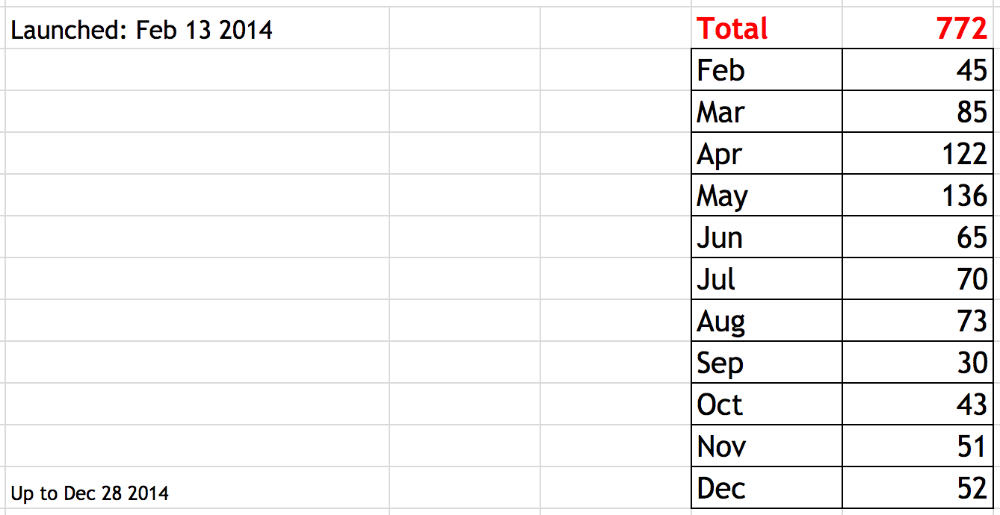

# Hello World, VietStack !

Hanoi  
November 15, 2014  
vietstack@gmail.com  

<http://vietstack.com/>

---

# Outline

- VietStack Overview
- Group statistics (11/2014)
  - Members
  - Blog Views
  - Topic
- GOALS - Activities
  - Goals
  - Activities
- VietStack <-> Triple-C 
- Q&A

---

# VietStack Overview

- Launched: [Feb][1] 13, [2014][1]
- Vietnamese Technical Channel about [Cloud Computing][1]
- Rapidly update with [OpenStack][] Community

[1]: http://
[OpenStack]: http://www.openstack.org

Note:
VS khoi diem tu ngay 13/2/2014, ban dau duoi mong muon tao mot kenh trao doi giua cac anh em ky thuat.

## Connect
- Blog: http://vietstack.wordpress.com	
- FB: http://facebook.com/groups/vietstack
- Email: [vietstack@gmail.com][]
- Git: http://github.com/vietstacker	
- TW: http://twitter.com/VietStack	
- Meetup: http://www.meetup.com/VietStack/	

[vietstack@gmail.com]: mailto:vietstack@gmail.com

---

# Group Statistics

- Members
- Blog Views
- Topics

## > [700][] Member (11/2014)

[700]: http://

Note:
Thang 4 va 5, VS tien hanh viet mot so blog chia se ve cach tim hieu OpenStack

## Blog Views
- Blog View: ~[1500][] monthly

[1500]: http://

## Top Views by Country
- Top view: [VN][1] & [US][1]

[1]: http://

Note: Blog da duoc mirantis crawl

## Topics
- Weekly topic by VietStack group:
 - Multi-hypervisor
 - Storage
 - Networking
 - Monitor
 
Note: 
Nhom duy tri 1 tuan 1 topic chinh de update va trao doi, su dung lam can cu cho public meetup sau nay
Cac thanh vien tham gia chia se gom tu chinh trong nhom: CongTT, TuanLH, HieuLQ, QuanHD, ThangMV.. cho toi cac member trong cong dong

---

# GOALS - Activities
Up to 2017

## Goals

Note:
- Deployment orchestration? Autoscaling?

## Activities

---

## What is OpenStack?

- "Infrastructure as a Service" (IaaS)
- A resource scheduler for your infrastructure
- A way to make more effective use of hardware resources

Note:
- an api for your datacenter
- matching workloads to available resources
- you want a fraction of a server? You can have a fraction of a
  server.

---

- A fundamental shift in how we manage infrastructure

Note:
In the old days, getting a web server, database, and storage from IT
could be difficult (or at least frustrating)...

- Call or email IT with request
- Maybe they have to contact someone else for network configuration
- Maybe they have questions for you
- Eventually you get what you wanted

---

## What OpenStack is not...

- A virtualization platform
- Freedom from Infrastructure
- Mature

---

## Development model

- Community developed
- Vendors and individuals
- Formal [code-review process][1]
- Six-month [release schedule][2]

[1]: https://wiki.openstack.org/wiki/Gerrit_Workflow
[2]: https://wiki.openstack.org/wiki/Releases

Note:
*Everything* goes through the review process.  Not just code, but
documentation, governance, infrastructure configuration, etc...

---

(from [Stackalytics][1])

[1]: http://stackalytics.com/

---

## Core [programs][]

[programs]: https://wiki.openstack.org/wiki/Programs

(As of Icehouse)

- [Ceilometer][] (Telemetry)
- [Cinder][] (Block Storage)
- [Glance][] (Image Service)
- [Heat][] (Orchestration)
- [Horizon][] (Dashboard)
- [Keystone][] (Identity)
- [Neutron][] (Networking)
- [Nova][] (Compute)
- [Swift][] (Object Storage)
- [Trove][] (Database Service)

[Ceilometer]: https://wiki.openstack.org/wiki/Ceilometer
[Cinder]: https://wiki.openstack.org/wiki/Cinder
[Glance]: https://wiki.openstack.org/wiki/Glance
[Heat]: https://wiki.openstack.org/wiki/Heat
[Horizon]: https://wiki.openstack.org/wiki/Horizon
[Keystone]: https://wiki.openstack.org/wiki/Keystone
[Neutron]: https://wiki.openstack.org/wiki/Neutron
[Nova]: https://wiki.openstack.org/wiki/Nova
[Swift]: https://wiki.openstack.org/wiki/Swift
[Trove]: https://wiki.openstack.org/wiki/Trove

<!-- .element: class="twocolumn" -->

Note:
"Programs of OpenStack are efforts which are essential to the completion of our mission."

---

## Accretion

---

You thought I was kidding with that lego slide, didn't you?

---

# Each (core) program has...

## Web UI in Horizon

## Command line tools

    $ nova list
    +-----...-+-------------...-+--------+------------+-------------+----------...------------------------------+
    | ID  ... | Name        ... | Status | Task State | Power State | Networks ...                              |
    +-----...-+-------------...-+--------+------------+-------------+----------...------------------------------+
    | 0ba8... | rdo-wp-mysql... | ACTIVE | -          | Running     | rdo-wp-fi...c3h=10.0.0.4, 192.168.200.249 |
    | 4f3d... | rdo-wp-wordp... | ACTIVE | -          | Running     | rdo-wp-fi...c3h=10.0.0.2, 192.168.200.248 |
    | 0bb6... | test0-myserv... | ACTIVE | -          | Running     | test0-fix...wo=10.0.0.2, 192.168.200.246  |
    +-----...-+-------------...-+--------+------------+-------------+----------...------------------------------+

## Python libraries

    from novaclient.v1_1 import client as novaclient

    nc = novaclient.Client(
        None,
        None,
        None,
        auth_url=args.os_auth_url,
        tenant_id=kc.tenant_id,
        auth_token=kc.auth_token)

    # Print a list of running servers.
    for server in nc.servers.list():
        print server.id, server.name

## REST API

    $ curl -i 'http://127.0.0.1:8774/v2/95d9bbd9b446438a89a353d8adb60704/servers/detail' \
      -X GET \
      -H "X-Auth-Project-Id: lars" \
      -H "Accept: application/json" \
      -H "X-Auth-Token: $AUTH_TOKEN"
    {
      "servers": [
        {
          "metadata": {},
          "config_drive": "",
          "OS-EXT-STS:power_state": 1,
          "progress": 0,
          "accessIPv6": "",
          "accessIPv4": "",
          "os-extended-volumes:volumes_attached": [],
          "OS-DCF:diskConfig": "MANUAL",
          "tenant_id": "95d9bbd9b446438a89a353d8adb60704",
    [...]

([API reference](http://developer.openstack.org/api-ref.html))

---

- Generally designed to "scale out"

Note:
If you need more performance out of a service, just add more
instances of that service.

---

# Keystone

## Identity Service

- Authentication (sometimes)
- Authorization
- Service catalog
- Policy engine

---

## Authentication

- SQL database
- LDAP backend
- External authentication (`REMOTE_USER`)

    (Apache or WSGI middleware)

---

## Authorization

- Does not need to be colocated with authentication data
- E.g., authentication in campus LDAP, role authorization in Keystone
  SQL database

---

## Service catalog

- Query for available services and endpoint URLs

      $ openstack endpoint list --long -c 'Service Name' \
        -c 'Service Type' -c 'PublicURL'
      +--------------+---------------+----------------------------------------+
      | Service Name | Service Type  | PublicURL                              |
      +--------------+---------------+----------------------------------------+
      | keystone     | identity      | http://127.0.0.1:5000/v2.0             |
      | heat         | orchestration | http://127.0.0.1:8004/v1/%(tenant_id)s |
      | neutron      | network       | http://127.0.0.1:9696/                 |
      | cinder       | volume        | http://127.0.0.1:8776/v1/%(tenant_id)s |
      | nova         | compute       | http://127.0.0.1:8774/v2/%(tenant_id)s |
      | ceilometer   | metering      | http://127.0.0.1:8777                  |
      | nova_ec2     | ec2           | http://127.0.0.1:8773/services/Cloud   |
      | glance       | image         | http://127.0.0.1:9292                  |
      | cinder_v2    | volumev2      | http://127.0.0.1:8776/v2/%(tenant_id)s |
      +--------------+---------------+----------------------------------------+

---

# Nova

## Compute Service

- Controls hypervisors, [bare metal servers][ironic],
  or containers
- Gets images from Glance, volumes from Cinder,
  networks from Neutron, and stitches everything together.

[ironic]: https://wiki.openstack.org/wiki/Ironic

---

- Supports [a number of hypervisors][hypervisors]:

  - `libvirt` (`QEMU` or `KVM`)
  - XenServer
  - VMware
  - HyperV

[hypervisors]: https://wiki.openstack.org/wiki/HypervisorSupportMatrix

---

- Supports some container technologies

  - LXC
  - [Docker][nova-docker]

[nova-docker]: https://wiki.openstack.org/wiki/Docker

---

- Provides flexible networking support

  - Multitenancy through VLANs
  - Floating IPs
  - Security groups
  - QoS

---

---

# Glance

## Image service

- A service for "discovering, registering, and retrieving virtual
  machine images" \[[1](http://docs.openstack.org/developer/glance/)]
- A library for you disk images

---

- Image properties can be used to control configuring of Nova servers
  - Specify minimum RAM/disk size requirements
  - Control selection of virtual hardware (what model NICs?)

---

# Cinder

## Block Storage Service

- Create and manage block devices
- Life cycle not tied to Nova servers
- Analagous to Amazon EBS

---

- Support for a variety of storage backends

  - Linux LVM
  - GlusterFS
  - Ceph RBD
  - $VENDOR

---

# Neutron

## Networking Service

- Replac(es/ing) Nova networking support
- Much more flexibility
- Much more complexity

---

---

- Multiple networks per project
- VXLAN, GRE, and VLAN for segmentation
- Floating ips, Provider networks, Load balancing, Firewalls, Security
  groups, Virtual routers...

---

## Oh my.

---

# Swift

## Object Storage Service

- Everything is a file
- Distributed
- Highly available
- Eventually consistent

---

# Ceilometer

## Telemetry Service

- Originally designed for billing
- Metrics collection ("metering")
- Alarm generation

---

# Heat

## Orchestration Service

- Template-based instantiation of complex "stacks" of resources
- Reproducible infrastructure
- Autoscaling
- Support for most OpenStack core programs

---

- Support for additional resource types via plugins
  - E.g., support for Docker containers
  - Only in-tree support for Docker at this time

---

(I ran a [Hangout on
Heat](http://blog.oddbit.com/2014/09/05/heat-hangout/) recently if you
are looking for more information.)

---

# Horizon

## Dashboard

- Web UI for OpenStack core components
- Extensible to support other services

---

---

# Getting started

---

---

---

# Installing OpenStack

- [Devstack](http://devstack.org/)
  - Fedora
  - CentOS
  - Ubuntu

---

- [RDO][] Packages available for:
  - CentOS
  - Fedora
  - RHEL

[RDO]: http://openstack.redhat.com/

---

# Getting help

- [IRC channels](https://wiki.openstack.org/wiki/IRC) (`#openstack`,
  `#rdo`)
- [Mailing list](https://wiki.openstack.org/wiki/Mailing_Lists)
- [ask.openstack.org][]

[ask.openstack.org]: http://ask.openstack.org/

---

# Who am I?

- `larsks` on [Freenode](https://freenode.net/)
- <lars@redhat.com>
- <http://blog.oddbit.com/>

---

The sources for these slides are available from:

- <https://github.com/larsks/openstack-overview-slides/>
