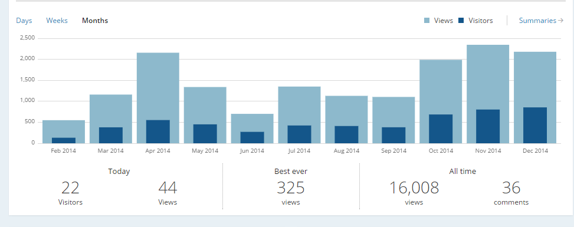
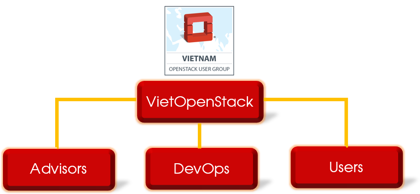

# Hello World, VietStack !

Hanoi

vietstack@gmail.com  

<http://vietstack.com/>

---

# Outline

- VietStack Overview
- Group statistics (11/2014)
  - Members
  - Blog Views
  - Topic
- GOALS - Activities
  - Goals
  - Activities
- VietStack ⇋ Triple-C 
- Q&A

---

# VietStack Overview

- Launched: [Feb][1] 13, [2014][1]
- Vietnamese Technical Channel about [Cloud Computing][1]
- Rapidly update with [OpenStack][] Community

[1]: http://
[OpenStack]: http://www.openstack.org

Note:
VS khoi diem tu ngay 13/2/2014, ban dau duoi mong muon tao mot kenh trao doi giua cac anh em ky thuat.

## Connect
- Blog: http://vietstack.wordpress.com	
- FB: http://facebook.com/groups/vietstack
- Email: [vietstack@gmail.com][]
- Git: http://github.com/vietstacker	
- TW: http://twitter.com/VietStack	
- Meetup: http://www.meetup.com/VietStack/	

[vietstack@gmail.com]: mailto:vietstack@gmail.com

---

# Group Statistics

- Members
- Blog Views
- Topics

## > [700][] Member (11/2014)

[700]: http://

Note:
Thang 4 va 5, VS tien hanh viet mot so blog chia se ve cach tim hieu OpenStack

## Blog Views
- Blog View: ~[1500][] monthly

[1500]: http://

## Top Views by Country
- Top view: [VN][1] & [US][1]

[1]: http://

Note: Blog da duoc mirantis crawl

## Topics
- Weekly topic by VietStack group:
 - Multi-hypervisor
 - Storage
 - Networking
 - Monitor
 
Note: 
Nhom duy tri 1 tuan 1 topic chinh de update va trao doi, su dung lam can cu cho public meetup sau nay
Cac thanh vien tham gia chia se gom tu chinh trong nhom: CongTT, TuanLH, HieuLQ, QuanHD, ThangMV.. cho toi cac member trong cong dong

---

# GOALS - Activities
Up to 2017

## Goals
- [Cloud Computing][1] & [OpenStack][1] knowledge sharing
- Building an OpenStack-geek Team
- Contribute to [OpenStack Foundation][1]
- Co-op with [Vietnamese][1] Community for solving OPS problems
- Connect with other members inside and outside [Vietnam][1]

[1]: http://

Note:
- Muc tieu

## Activities

- Public Meetup <!-- .element: class="fragment" data-fragment-index="1" -->
- Connecting Technical-Cloud-DevOp guys <!-- .element: class="fragment" data-fragment-index="2" -->
- Communication Channel <!-- .element: class="fragment" data-fragment-index="3" -->
- Publish techical post (via FB, Blog..) <!-- .element: class="fragment" data-fragment-index="4" -->

---

# VietStack Public Meetup

- 

Note:
- an api for your datacenter

---

# DevOps Team

- 

Note:

---

# Communication Channel

- *IRC*

---

## Technical Knowledge

- 

Note:

---

# VietStack ⇋ TripleC

TripleC: Community - College - Corporation

# ⇨

# ⇦

---

# VietStack Thank You All !

